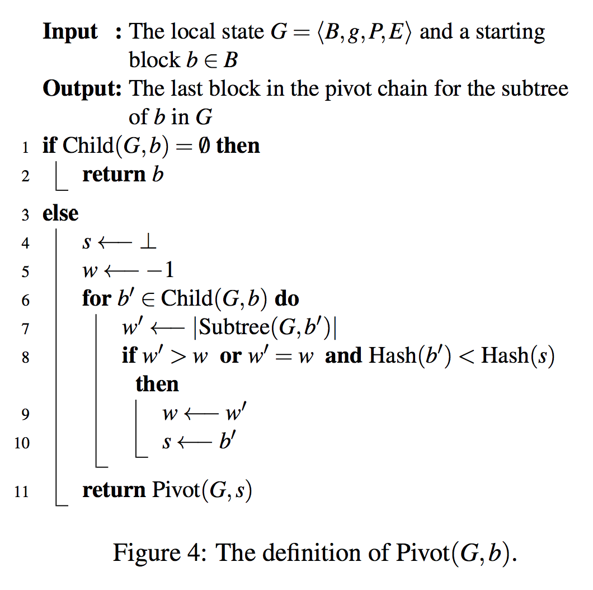
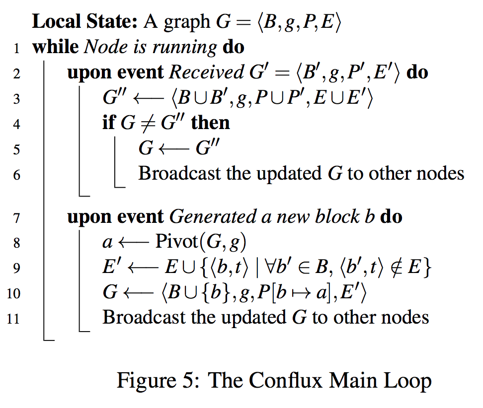
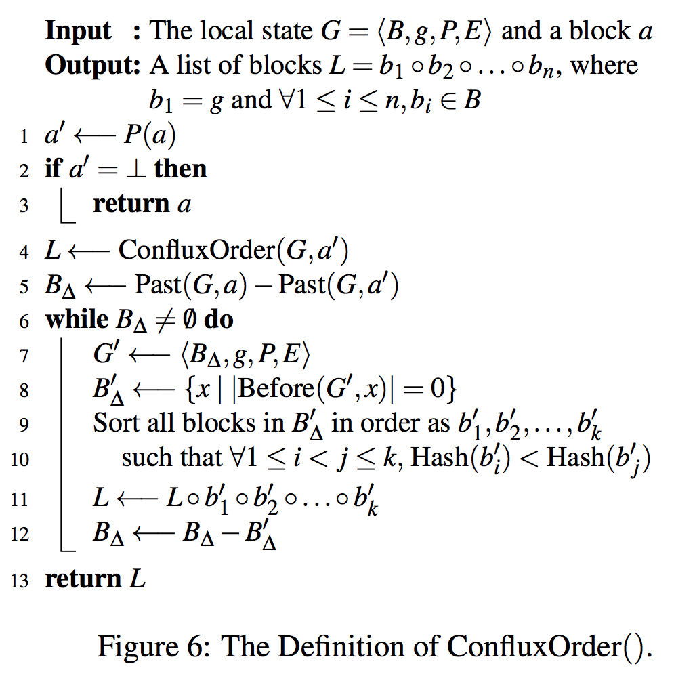

# Conflux algorithm
## 概要介绍
Conflux算法是一种DAG算法，相较于传统的单链结构，其特点是可以同时在图的不同位置插入很多块，然后通过一个算法评定标准来确定块与块之间的顺序。

以上图为例，一个conflux算法是这么确定全序，主要分为几个步骤：  

1. 定义说明   
parent edge，父边，每个块只有一个父边，指向父节点  
ref. edge，引用边，每个块可以有零个或多个引用边，指向其他节点

2. 确定pivot chain   
pivot chain的定义为依次相连的块子树最多的块组成的主链，在上图中即为Gennesis <- A <- C <- E <- H。这里注意两点，一是依次相连，pivot chain是通过父边依次相连，二是子最多，这里子树关系也只考虑父边，另外如果子树数目相同，则比较块hash值大小，优先选小的。这里具体作下说明，毫无疑问，Genesis块是pivot chain的开始，它拥有12个子树块（不包括新加入块New Block）；接着是A与B竞争，A拥有6个子树块，B拥有5个子树块，所以A成为pivot chain的第二环；然后是C，D，G三个块竞争，C有3个子树块，D，G各只有一个，所以C成为第三环；最后是E和H分别无竞争的成为第四环和第五环。

3. 根据pivot chain划分epoch，确定每个epoch里的序   
确定pivot chain后，根据pivot chain中每一个块划分一个epoch。接下来如何判断每个非pivot chain的块属于哪个epoch呢，需要明确的是每个块只属于一个epoch，且仅属于被pivot chain中的块最先直接或间接指向的块，这里指向包括父边和引用边。具体说明下，B被C指向，则B属于C的epoch，D和F被E指向，则D和F属于E的epoch，G和I被H指向，J又被I指向（相当于J被H间接指向），所以G，J，I都属于H的epoch，这样，块划分epoch完毕。  
接下来是对每个epoch中的块进行排序，排序过程中只考虑每个epoch中内部块之间的指向关系。排序按照如下原则，如果块没有前继块即在该epoch没有指向其他块，那么首先把这些没有前继块的块拿出来按hash值从小到大排序，然后除去这些块后，继续拿出没有前继块的块，按hash值排序，接着之前的排序，循环如此，这样就得到一个epoch内的序。具体说明，在C的epoch中，先是B没有前继块，然后去掉B，只剩下C没有前继块，所以C的epoch中的序是B <- C；在E的epoch中，D和F都没有前继块，但比hash值D小于F，所以是D <- F，然后是E，最终是D <- F <- E；在H的epoch中比较复杂，首先没有前继块的是G和J，G小于J，所以是G <- J，然后是I，最后是H，所以最终是G <- J <- I <- H。这样所有的epoch中的序都确定了。

4. 串联epoch中所有块，确定全序   
根据之前的各epoch中的排序，最终得到的全序是，Gennesis <- A <- B <- C <- D <- F <- E <- G <- J <- I <- H  

后续详细说明下论文中主要对于算法定义的四张图：  
- 第一张图为各种图关系定义    
- 第二张图为Pivot算法定义    
- 第三图为共识程序主循环    
- 第四图为拓扑序求解    

## 图关系定义
首先是第一张图，对应论文的图3，看懂图关系定义是为了方便看懂后续算法实现：

`G`为`图定义`，`<B, g, P, E>`分别为`<块集合，创世块，父关系函数，边集合>`  
`Chain(G, b)`为`从创世块沿着父关系到块b的链`  
`Child(G, b)`为`满足父关系块为块b的所有子块集合`  
`Sibling(G, b)`为`与块b有同父关系块的所有块（不包含块b）集合`  
`Subtree(G, b)`是一个递归定义，为`包含块b，及所有块b的子块集合，及块b的子块的子块集合......以此类推`  
`Before(G, b)`为`块b的所有前继块（父关系块也属于一种前继块）集合`  
`Past(G, b)`也是一个递归定义，为`包含块b，及块b的前继块集合，及块b的前继块的前继块集合.....以此类推.`  
`TotalOrder(G)`为`拓扑序，使用第二部分和第四部分的算法来具体实现`  

## Pivot算法定义
一言以蔽之，Pivot算法是一种选主链的最后一个块的算法：  

输入为`图G与一个开始块b`  
输出为`pivot链的最后一个块`  
这个程序比较简单，通过尾递归的形式来求解，每一次求解出块b的子块中的每个Subtree块数最多的的块即为目标块，若Subtree块数相同则比较块本身的hash值大小，hash值小则为目标块。  

## 共识程序主循环
共识程序主循环，主要接受两种事件，`通过gossip网络传播来的新图G'`，以及`生产出新块b`  

算法首先有一个本地状态，即图G  
对于第一种事件，`通过gossip网络传播来的新图G'：将其与本地状态图G取并集得到G''，若与图G不同则更新，并传播G''`  
对于第二种事件，`生产出新块b：首先通过Pivot算法取得最后一个块a，然后做两个操作，一是将块b的父关系块设为块a，二是将块b使用reference edge（区别于父关系边的另一种边）指向所有没有被其他块指向的块`  

## 拓扑序求解

输入为`图G以及块a`  
输出为`从创世块开始的所有块的拓扑序的链`  
这个算法是倒推的，用递归来实现的：  
1-4行，`取块a的父关系块，一直递归到创世块为止，返回传世块作为链L的第一个块，然后对创世块的第一个子块进行后续计算`  
5行，`取块a的前继块集合和块a的父关系块的前继块集合的差集B*`  
6-12行，`若差集B*非空则将差集块赋予新图G'，算出G'中前继块数目为0的所有块集合B*'，按hash值从小到大排序后接入链L中，然后取差集B* = B* - B*'，循环执行6-12行`  
13行，`返回链L`
